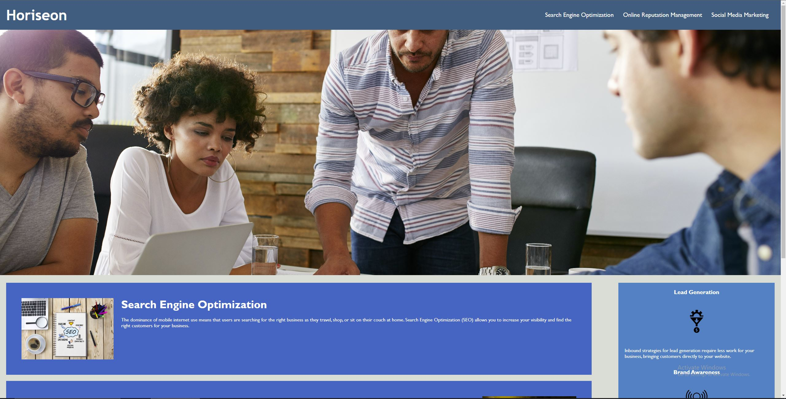
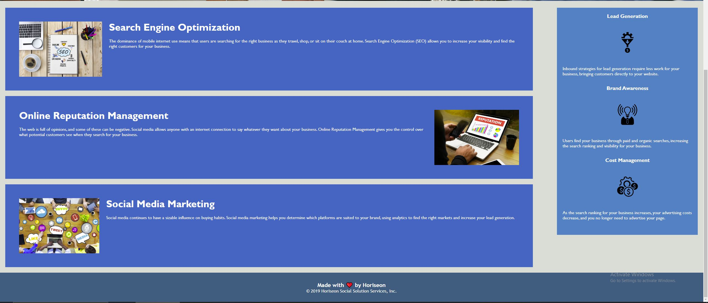

#H1 **Horiseon**

##H2
Was hired by a marketing ageny to refactor code to a codebase that follows accessibility standards.
Through this I have learned to change pre-existing elements to new elements in **HTML** and **CSS** as well as
how to clean up unnecesary code.

###H3
[LIVE SITE](https://derricklaff.github.io/Horiseon/)
[REPO LINK](https://github.com/Derricklaff/Horiseon)
